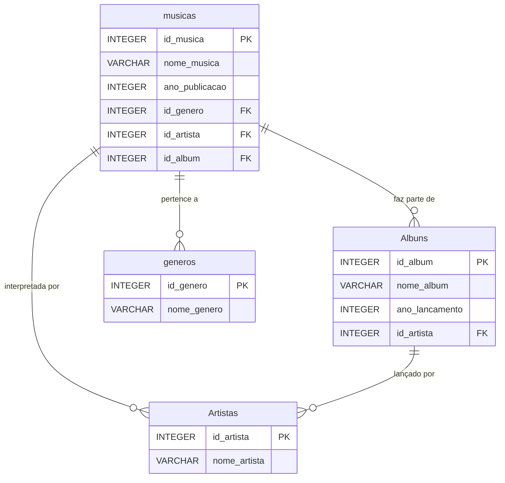

# 🎵 Catálogo Musical - Banco de Dados SQL

Um projeto de banco de dados para catalogar minhas músicas favoritas, organizando-as por artistas, álbuns e gêneros. Este projeto tem como objetivo demonstrar a modelagem de dados relacionais e a manipulação de dados com SQL.

## 🚀 Funcionalidades

* Criação de uma estrutura de banco de dados com 4 tabelas `generos` `Artistas` `Albuns` `musicas`
* Uso de chaves primárias e estrangeiras para criar relacionamentos entre as tabelas.
* Inserção de dados de artistas como Luan Santana e VMZ.
* Consultas para extrair informações significativas dos dados.

## 🛠️ Tecnologias Utilizadas

* **SQL** (SQLite)
* **Git** e **GitHub** para versionamento
* **Visual Studio Code** como editor de código

## ⚙️ Como Usar

1.  Garanta que você tenha um cliente de banco de dados compatível com SQLite (como a extensão do VS Code ou o DBeaver).
2.  Copie o conteúdo do arquivo `schema.sql`.
3.  Execute o script SQL no seu cliente para criar e popular o banco de dados.

## 📈 Estrutura do Banco de Dados

O diagrama abaixo ilustra como as tabelas se relacionam:

## 🧑‍💻 Autor

* **Eduardo Ribeiro** - [GitHub](https://github.com/Eduardoribeiro20)
